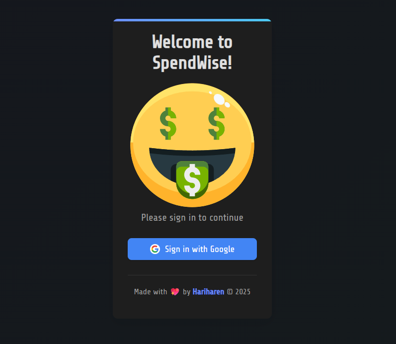
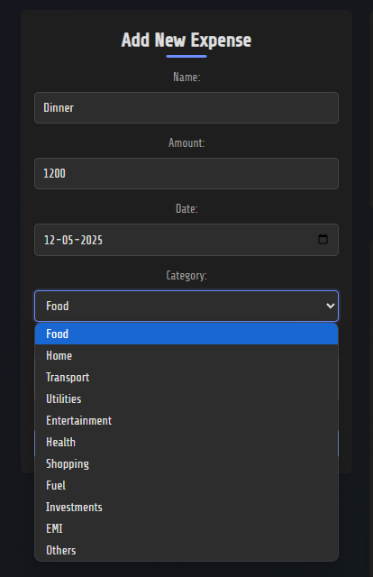
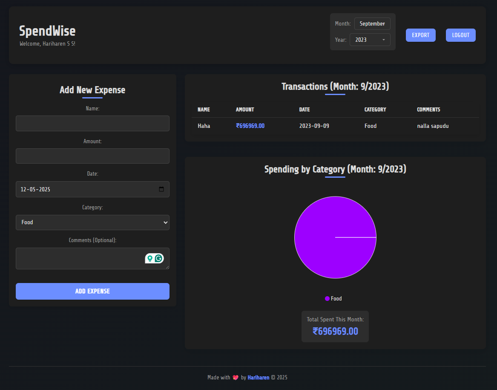

# SpendWise - Expense Tracker done right!
Welcome to SpendWise, a sleek expense tracker built with React.js and Firebase. This app allows you to track your expenses, visualize your spending patterns, and stay on top of your finances.

  

## 🚀 Features

### 📊 Expense Management
- Add, edit, and delete expenses with ease
- View all transactions in a clean, sortable table
- Filter expenses by month and year
- Export expense data to CSV for analysis

### 📈 Data Visualization
- Interactive pie charts showing spending by category
- Monthly spending breakdowns
- Visual representation of your financial habits

### 🔐 Secure Authentication
- Google Sign-In integration
- User-specific data storage
- Protected expense tracking

### 🎛️ Dashboard Features
- Welcome message with personalized greeting
- Intuitive month/year selector
- Responsive design for all devices
- Dark theme for comfortable viewing

## 🛠️ Technology Stack

- **Frontend**: React.js with Vite
- **Styling**: CSS Modules
- **Charts**: Chart.js
- **Backend**: Firebase
  - Firestore Database
  - Authentication

## 📸 Screenshots

  

   <em>Login Page</em>
    
   
  

  

  <em>Add a new Expense</em>
    
    
  

  
  <em>Dashboard</em>

## ⚡ Getting Started

1. Clone the repository
2. Install dependencies: `npm install`
3. Configure Firebase credentials
4. Run the app: `npm run dev`

## 📝 Notes

Feel free to use this as your daily expense tracker. If you have any questions or suggestions, please open an issue. Or you can also contribute to this project and make it even better!
## 📜 License
This project is licensed under the MIT License - see the [LICENSE.md](LICENSE.md) file for details.

Created with ❤️ by [Hariharen](https://www.linkedin.com/in/hariharen9/)

© 2025 SpendWise
